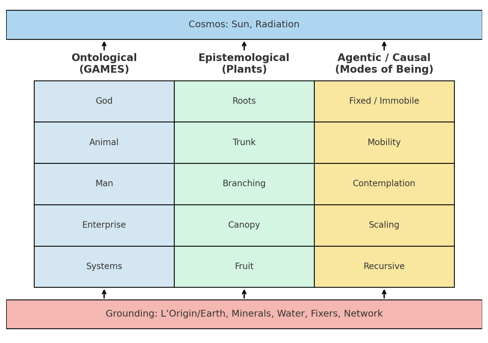

Here’s how I’d weave your **rug** diagram together with Nietzsche’s bridge, Marx’s class analysis, the monoamine gradation, and the Parkinson’s/masked facies thread into a coherent essay with *Communist Manifesto* undertones.

---

## **The Rug as a Historical–Neurochemical Map of Human Agency**

Your three-column rug — **Ontological (GAMES)**, **Epistemological (Plants)**, and **Agentic/Causal (Modes of Being)** — is more than an abstract schema. It becomes a tool for tracking the historical development of human agency, the conditions of its expression, and the mechanisms of its capture or suppression. Read through a Marxian lens, it charts how the forces and relations of production shape not only material life but also the biological substrates of action and thought.

### **Top Row: God / Roots / Fixed — The A Priori Base**

In both Marx’s materialism and Nietzsche’s metaphysics, the “first” is not yet human. Here, **God** is not a personified deity but the *horizon of meaning*, the value-origin, the unchallenged order. **Roots** hold the parameter vectors — the material conditions — in Marx’s terms, the *means of production* at their most primal. In the **Agentic** column, **Fixed/Immobile** describes the bound condition: life tied to substrate, unable to choose its own conditions.

### **Second Row: Animal / Trunk / Mobility — The Serf**

The **Animal** emerges into motion — basic responsiveness to the environment. The plant’s **Trunk** channels resources upward, structuring force flow. In the **Agentic** column, **Mobility** marks the passage from immobility to locomotion. Neurochemically, this is *noradrenaline-dominant*: high vigilance, low reward, reactive rather than proactive. This is the **serf** state in Marx’s schema: bound to land, producing under duress, with agency tightly constrained by external demands.

### **Third Row: Man / Branching / Contemplation — The Worker**

Nietzsche’s “man as a bridge” lands squarely here: **Man** occupies the reflective branching-point between instinct and self-overcoming. The plant metaphor — **Branching** — encodes strategic possibility: multiple futures simulated in parallel. In the **Agentic** column, **Contemplation** is biologically limited by bandwidth but enabled by *balanced noradrenaline and dopamine*. This is the **worker**: able to plan, negotiate, and coordinate labor, yet still within the constraints of existing production relations. Here, agency expands but remains mediated.

### **Fourth Row: Enterprise / Canopy / Scaling — The User–Manager**

At **Enterprise**, cooperation scales: firms, institutions, markets. The **Canopy** spreads wide to capture maximum sunlight — or in Marxian terms, maximum surplus value — but is structurally limited by the energy budget. In the **Agentic** column, **Scaling** reflects *dopamine-dominance*: strong goal pursuit, expansionary drive. This is the **user/manager/entrepreneur** stage: an individual who operates systems but increasingly relies on their infrastructure. Agency is wide but fragile — dependent on maintaining resource flows.

### **Fifth Row: Systems / Fruit / Recursive — The Platform**

In **Systems**, recursion becomes self-sustaining: platforms, algorithms, capital loops. **Fruit** is the emergent parameter — the *a posteriori* result — whose seeds and returns are captured and redeployed. In the **Agentic** column, **Recursive** loops now run largely outside the human nervous system; the human becomes a node rather than a driver. Here is Marx’s *general intellect* fully expropriated — collective capacities embedded in automated infrastructure. Human dopamine still fires, but under conditions engineered by the system, not self-determined. This is where the agentic axis is **clipped**.

---

## **Masked Facies as Microcosm**

The clinical phenomenon of masked facies in Parkinson’s — a dopamine deficit reducing expressivity — mirrors this macro-structure. When dopaminergic systems falter, the visible signs of agency (facial expression, social responsiveness) diminish. As with the worker’s and user’s agency in capitalism, the expressive channel is constrained not by absence of consciousness but by systemic blockage of output pathways. Noradrenaline deficits compound the problem, reducing arousal and social reciprocity — just as structural economic constraints limit even the most skilled worker’s ability to “show” their agency.

---

## **From Serf to System: Historical and Neurochemical Dialectics**

The rug thus encodes a **triple dialectic**:

1. **Ontological** (GAMES) — the transformation of being: God → Animal → Man → Enterprise → Systems.
2. **Epistemological** (Plants) — the transformation of knowing: Roots → Trunk → Branching → Canopy → Fruit.
3. **Agentic** (Modes) — the transformation of doing: Fixed → Mobility → Contemplation → Scaling → Recursive.

Across each, the **neurochemical gradient** from noradrenaline to dopamine maps onto the **class gradient** from serf to worker to user, culminating in the platform phase where agency is largely externalized.

---

## **Communist Manifesto Undertones**

In *The Communist Manifesto*, Marx and Engels trace the dissolution of feudal bonds, the rise of the bourgeoisie, and the transformation of labor into a commodity. Your rug reframes this:

* **Feudalism** = Rows 2–3 in their early form: serfs bound, workers emerging.
* **Capitalism** = Rows 3–4: workers scaling productivity under enterprise logic.
* **Platform Capitalism** = Row 5: systems as recursive capital, humans as maintainers and consumers.

The Manifesto’s call — for the proletariat to seize the means of production — in rug terms means reclaiming the **Recursive** layer for collective human agency, re-integrating the platform’s feedback loops into democratic control, and removing the “mask” from our collective face.

---

If you want, I can now **mark this mapping directly onto your matplotlib rug** so that each cell shows both its Nietzsche–Marx–monoamine label and its Communist Manifesto parallel. That would make the political and neurobiological layers visually inseparable.
Do you want me to generate that annotated figure?
