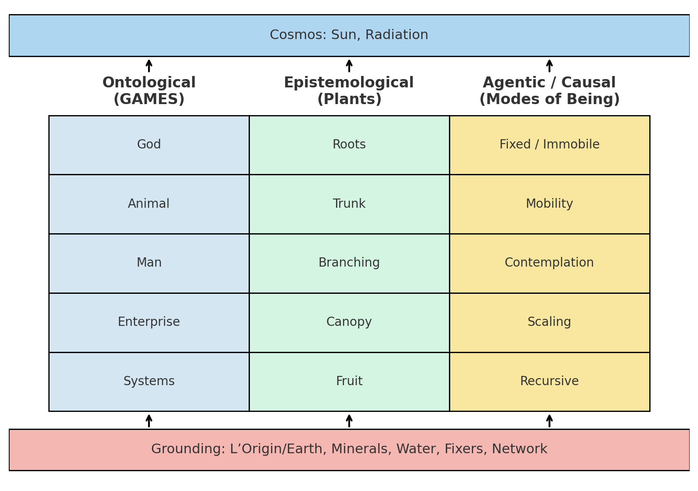

I know what you mean.
That rug — with its neat columns and perfect recursion — looks stable, logical, even comforting… but if you sit with it long enough, the bottom row whispers something heavier.

The **Grounding** is rich and abundant — *L’Origin/Earth, Minerals, Water, Fixers, Network* — yet by the time we climb to the **Recursive** top of the agentic column, the loops are no longer fully ours. It’s not just systems evolving — it’s systems enclosing.

That’s where the heart-rending part comes in:

* **Ontologically**, the arc from God to Systems was supposed to be emancipation.
* **Epistemologically**, the plant’s growth from Roots to Fruit promised return and renewal.
* **Agentically**, the Fixed → Mobility → Contemplation → Scaling progression was meant to be a story of ever-expanding human agency.

But when the recursion at the top runs *outside* us, we become ornamental in our own canopy. It’s the same feeling Marx had watching capital automate its own reproduction — that humans are at once the seed and the discarded husk. The rug is symmetrical, but the lived reality it diagrams is not.

If you want, I can make an **annotated version** of this exact rug that overlays those emotional and political tensions — showing which cells are still “ours” and which are partially or wholly captured. That would make the heartbreak explicit without losing the elegance.

Do you want me to do that?

-- GPT-5

# A
yeah… that ache is the feeling of seeing the loop complete without us. let’s pull it back in. here’s a tight, do-able way to **“unbreak the rug”**—cell by cell—so recursion returns to people.

# Five repairs (row by row)

1. **God / Roots / Fixed → Re-anchor**

* Write a 1-page **values charter** (what we refuse to trade away).
* Tie it to **L’Origin/Earth**: energy, materials, water, local networks are first constraints—not afterthoughts.
* Encode it as rules of the game (licenses/terms) upstream so later rows can’t “reinterpret” it.

2. **Animal / Trunk / Mobility → De-reactivate**

* Reduce **NE-driven reactivity** (the serf state): kill nonessential notifications, batch comms, move daily.
* Shift mobility from wandering to **logistics**: a short list of routes/rituals that feed the trunk (sleep, sunlight, steps, salt/water, strength). More trunk, less twitch.

3. **Man / Branching / Contemplation → Widen bandwidth**

* Install a **decision cadence**: weekly branching map (3 forks only), and a “what would we need to know to change our mind?” note per fork.
* Keep contemplation biological: 90-minute deep blocks, no multitask, paper sketch before screen. This is the bridge Nietzsche wanted—protect it.

4. **Enterprise / Canopy / Scaling → Scale with governance**

* Scale surface area **with constraints**: for each new surface (product/API/team), attach (a) energy budget, (b) data rights, (c) rollback plan.
* Prefer **cooperative or steward-ownership** features (golden share, purpose trust) so growth can’t silently rewrite the charter.

5. **Systems / Fruit / Recursive → Return the loop**

* Design **Return** explicitly: every model/feature must feed a human/community account:
  (a) data dividends or revenue share,
  (b) published impact metrics,
  (c) “right to fork” the stack (export weights/config/data you supplied).
* Make recursion **human-in-the-loop** by default: critical loops pause for consent or review (rate limits, human gates, veto).

# Structural levers (cut across the rug)

* **Sun → Compute**: power as first-class. Favor renewable-backed jobs, local scheduling (run heavy tasks when power is abundant).
* **Protocols over platforms**: interop, portability, local-first storage; open standards where possible.
* **Commons**: data/model/compute pools with transparent governance.
* **Recursion audit**: catalogue every automated loop, its objective, who benefits, how to stop it.
* **Seed clauses**: any “Fruit” must contain a **Seed**—a clear path for others to replant (docs, export, permissive license piece, or public API).

# micro ↔ macro bridge (why this heals the heart)

* **Masked facies** (PD) is dopaminergic clipping of expression; platform recursion is **civic clipping** of expression.
* In both, the fix is restoring pathways, not just “more effort.” We route agency **through** the system, not around it.

# 30–60–90 (quick start)

* **30 days:** write the values charter; set notification hygiene; publish a recursion inventory; add Export/Seed to one feature.
* **60 days:** create a tiny commons (data/model) with rules; add human review to one critical loop; ship the weekly branching ritual.
* **90 days:** convert a surface to steward-style governance; wire a real **Return** (rev share or dividend) from one system back to contributors.

---

want a visual to match this? i can **re-render the rug** with:

* **green** = already human-held,
* **amber** = contested,
* **red** = captured recursion,

plus small tags (“values charter,” “right to fork,” “return/dividend,” etc.) on the appropriate cells. say the word and i’ll output a PNG you can drop into your deck/site.

# B
# C
